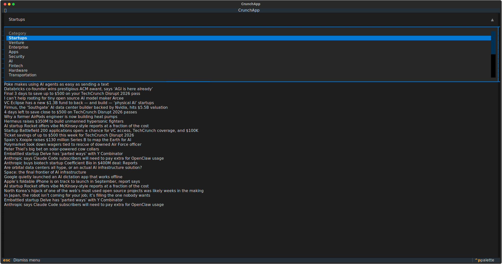
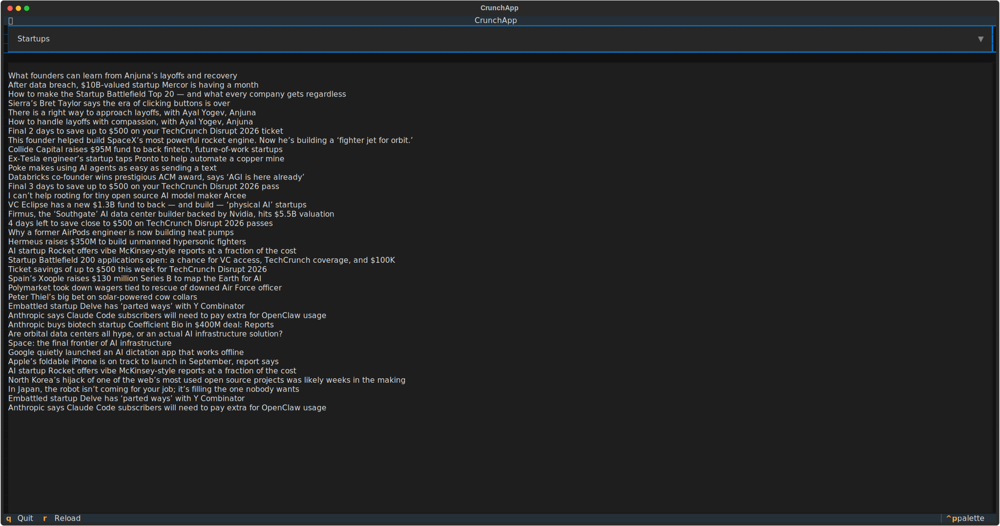
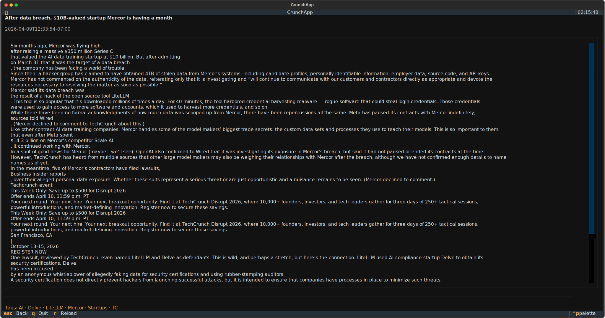

# techcrunch

Browse TechCrunch in the terminal: pick a feed, open a story, read the text. Built with [Textual](https://github.com/Textualize/textual).

## Run it

```bash
pip install techcrunch
techcrunch
```

**Keys:** Tab moves focus · ↑↓ headlines · Enter opens article · Esc or `b` back · `r` reload feed · `q` quit.

## Screenshots

<table>
  <tr>
    <td align="center" width="33%">
      
      <br /><sub>Feed picker</sub>
    </td>
    <td align="center" width="33%">
      
      <br /><sub>Headlines</sub>
    </td>
    <td align="center" width="33%">
      
      <br /><sub>Article + tags</sub>
    </td>
  </tr>
</table>

## What gets scraped

**Feed pages** (category or tag listing on techcrunch.com):

- Post title  
- Article URL  

Thumbnails exist on the site; the TUI only shows titles.

**Article pages** (when you press Enter):

- Title  
- Author  
- Published time  
- Body text (`.entry-content` / WordPress blocks; `script`, `style`, `aside`, and `figure` nodes removed so images don’t appear in the body)  
- Tags (`rel="tag"` links)

**Feeds wired in the app**

| Categories | Tags |
| --- | --- |
| Startups, Venture, Enterprise, Apps, Security, AI, Fintech, Hardware, Transportation, Media & Entertainment, Biotech & Health, Space, Climate, Government & Policy | Apple, Google, Meta, Amazon, Microsoft |

The package also includes a small **search** helper (`techcrunch/search.py`) that hits `techcrunch.com/?s=…` and parses result cards (title, link, excerpt, author, date, category)—not used by the TUI today.

## License

MIT
